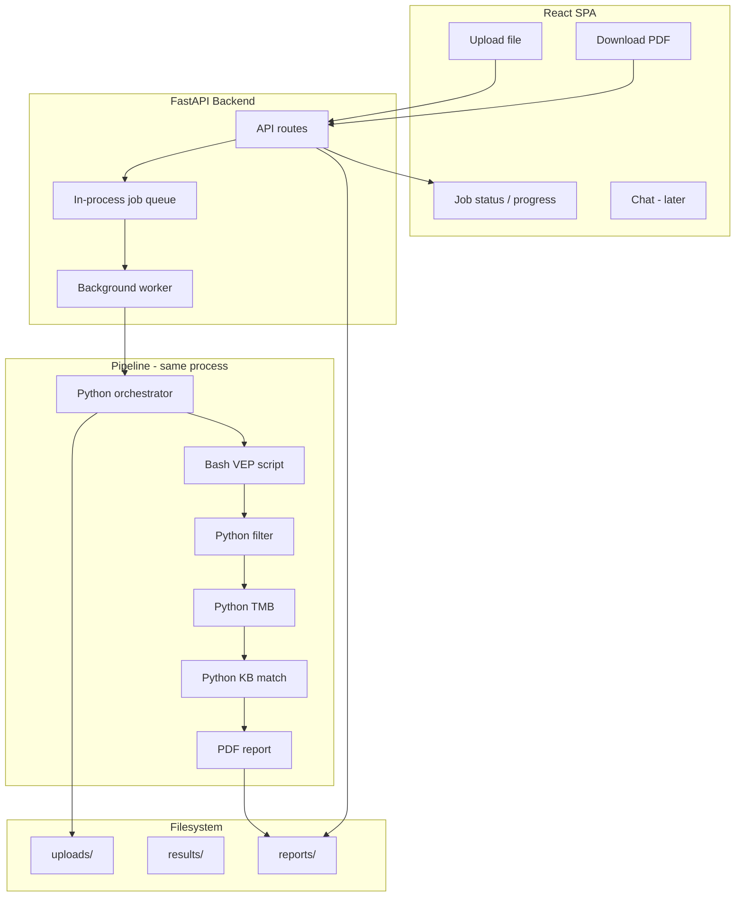

# OncoCompass — Final Implementation Plan

**Stack:** FastAPI backend, React SPA frontend, filesystem-only storage, in-process background jobs. Annotated variant data uses **Annotated VCF format stored as `.txt`**. PDF report as final output; **chat interface** to be added later for user interaction with the report.

---

## 1. Architecture Overview



- **User** uploads a file (raw VCF or pre-annotated **.txt** in Annotated VCF format) via React SPA → **FastAPI** saves to `uploads/{job_id}/`, enqueues job, returns `job_id`.
- **Frontend** polls `GET /jobs/{job_id}` for status (`pending` | `running` | `completed` | `failed`).
- **Worker** (same process): runs Python orchestrator; orchestrator runs Bash (VEP) only for raw VCF (outputs annotated **.txt**), then Python filter → TMB → KB match → **PDF report** under `reports/{job_id}/report.pdf`.
- **User** downloads PDF via `GET /jobs/{job_id}/report`. Later: **chat** for user to interact with the report (same FastAPI app).

---

## 2. File format: Annotated VCF as .txt

- **Input**
  - **Raw VCF** — user uploads `.vcf` (or `.vcf.gz`); pipeline runs VEP to produce annotated output.
  - **Pre-annotated** — user uploads **Annotated VCF format as `.txt`**; annotation step is skipped.
- **Pipeline**
  - VEP (Bash) output is written as **Annotated VCF in `.txt`** (e.g. `annotated.txt` under `results/{job_id}/`).
  - All downstream Python steps (filter, TMB, KB match) **read from this `.txt`** (same columns/semantics as VEP text output).
- **Rationale:** Single canonical format (Annotated VCF .txt) for annotated data; avoids ambiguity between raw VCF and annotated content.

---

## 3. Tech stack

| Concern | Choice | Notes |
|--------|--------|--------|
| **Backend** | FastAPI | Async, same process as pipeline; easy to add chat later. |
| **Frontend** | React SPA | Upload, job status, PDF download; chat UI later. |
| **Background jobs** | One thread + `queue.Queue` | In-process; no Celery/Redis. |
| **Job state** | In-memory dict + optional `results/{job_id}/status.json` | No DB. |
| **Storage** | Filesystem only | `uploads/{job_id}/`, `results/{job_id}/`, `reports/{job_id}/`. |
| **Pipeline** | Python 3.10+ orchestrator | Calls Bash (VEP) via `subprocess`; Python filter, TMB, KB. |
| **Annotated format** | Annotated VCF as `.txt` | VEP output and pre-annotated uploads use this. |
| **PDF** | WeasyPrint / ReportLab / fpdf2 | Report from pipeline results. |
| **Config** | `.env` or `config.yaml` | VEP script, cache, knowledge base, data dirs. |

---

## 4. Project layout

```
OncoCompass/
├── backend/
│   ├── main.py              # FastAPI app, routes, job queue + worker
│   ├── config.py            # Load paths and settings
│   ├── jobs.py              # Job state (in-memory + optional file)
│   └── pipeline/
│       ├── orchestrator.py  # run_vep (if raw VCF) → filter → tmb → kb → pdf
│       ├── filter_pipeline.py
│       ├── tmb.py
│       ├── knowledge_base.py
│       └── report_pdf.py
├── scripts/
│   └── run_vep.sh           # Bash VEP; args: input_vcf output_txt (Annotated VCF .txt)
├── frontend/                # React SPA
│   ├── src/
│   ├── public/
│   └── package.json
├── data/                    # VEP cache, knowledge base
├── uploads/                 # Runtime: uploads per job_id
├── results/                 # Runtime: annotated.txt, intermediates, status per job_id
├── reports/                 # Runtime: PDF per job_id
├── requirements.txt
├── .env.example
├── plan.md                  # This plan
└── README.md
```

---

## 5. Job flow

- **Queue:** One `queue.Queue` of job IDs. On upload, save file to `uploads/{job_id}/`, push `job_id`, return `job_id`.
- **Worker:** Background thread: `job_id = queue.get()` → `orchestrator.run(job_id, ...)`.
- **Orchestrator:**
  - If raw VCF: run `run_vep.sh` (input VCF → `results/{job_id}/annotated.txt`).
  - If pre-annotated .txt: copy/move to `results/{job_id}/annotated.txt` (or use as-is).
  - Filter reads `annotated.txt` → TMB → KB match → `report_pdf.generate(...)` → `reports/{job_id}/report.pdf`.
- **Status:** `jobs[job_id] = { status, progress?, error? }`; optionally persist to `results/{job_id}/status.json`.

---

## 6. API contract

- `POST /upload` — form-data: `file` (VCF or Annotated VCF .txt), optional `skip_annotation` (boolean). Save to `uploads/{job_id}/`, enqueue job, return `{ "job_id": "..." }`.
- `GET /jobs/{job_id}` — `{ "status": "pending|running|completed|failed", "progress": "...", "error": "..." }`.
- `GET /jobs/{job_id}/report` — PDF file (404 if not ready).

**Later (chat):** `POST /chat` or WebSocket; user interacts with report; same FastAPI app.

---

## 7. Pipeline orchestration (Bash + Python)

- **Input:** Path to uploaded file; type inferred (e.g. `.txt` → pre-annotated) or `skip_annotation` from form.
- **Steps:**
  1. **Raw VCF:** `subprocess.run(["bash", "scripts/run_vep.sh", input_vcf, "results/{job_id}/annotated.txt"], ...)`.
  2. **Pre-annotated .txt:** Use file as `results/{job_id}/annotated.txt` (no VEP).
  3. Python filter reads `results/{job_id}/annotated.txt` → filtered variants.
  4. TMB from filtered variants.
  5. KB match → therapies + evidence.
  6. `report_pdf.generate(..., path=reports/{job_id}/report.pdf)`.
- **Output:** PDF; job status `completed` or `failed` with error.

---

## 8. PDF report

- **Content:** Summary, TMB, actionable variants table, therapies, evidence levels, biomarker notes.
- **Library:** WeasyPrint (HTML→PDF), ReportLab, or fpdf2.

---

## 9. Frontend (React SPA)

- **Upload:** Form with file input (VCF or .txt), optional “Skip annotation” (or auto-detect from extension).
- **Status:** Poll `GET /jobs/{job_id}` every 2–3 s; show Processing / Completed / Failed.
- **Download:** When `completed`, “Download PDF” → `GET /jobs/{job_id}/report`.

**Later:** Chat view so user can interact with the report (new route + API).

---

## 10. Future chat interface

- Add chat routes/WebSocket to the same FastAPI app.
- Chat can use pipeline results (e.g. load `results/{job_id}/` and report summary) to answer questions.
- No change to pipeline or job runner; chat is an additional consumer of job results.

---

## 11. Implementation order

1. **Project structure** — Backend/frontend/pipeline dirs, `uploads/`, `results/`, `reports/`, config.
2. **Pipeline orchestrator** — Optional VEP (Bash) → output **Annotated VCF .txt**; then filter, TMB, KB (read .txt).
3. **PDF report** — `report_pdf.generate()` from pipeline results.
4. **FastAPI app** — Upload, `GET /jobs/{job_id}`, `GET /jobs/{job_id}/report`; CORS for React; optionally serve built SPA.
5. **Job runner** — In-process queue + worker thread; job state in memory (+ optional status.json).
6. **React SPA** — Upload, status polling, PDF download.
7. **Chat** — Stub or placeholder for future chat route and UI.

This is the final plan: **FastAPI + React SPA**, **Annotated VCF as .txt** for annotated data, **PDF report**, **chat later**.
